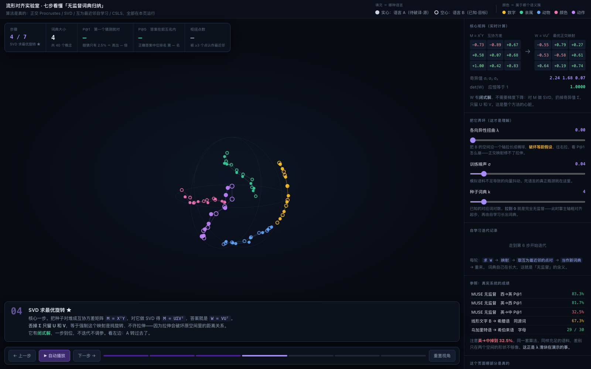
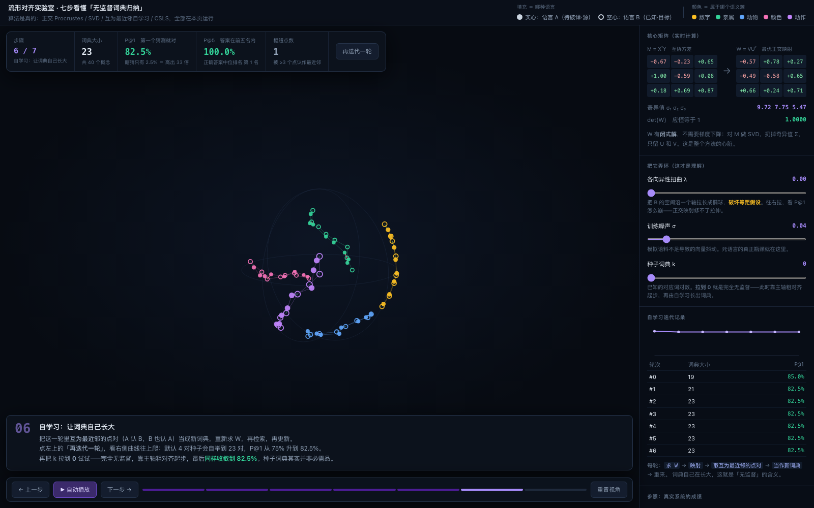
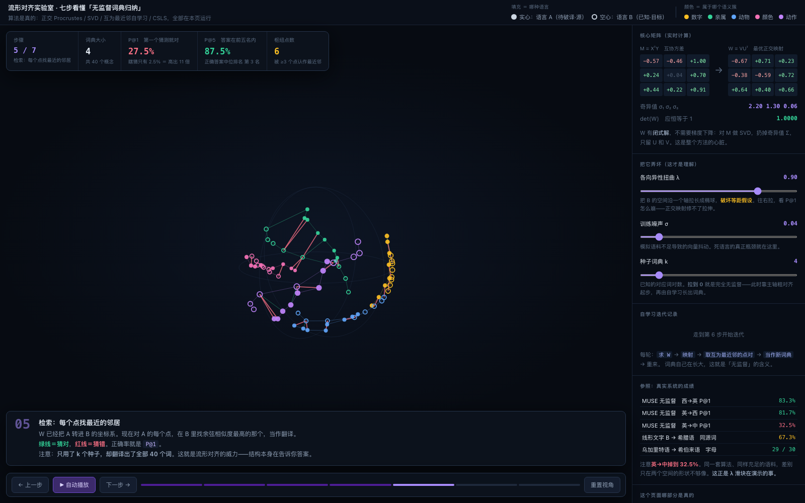
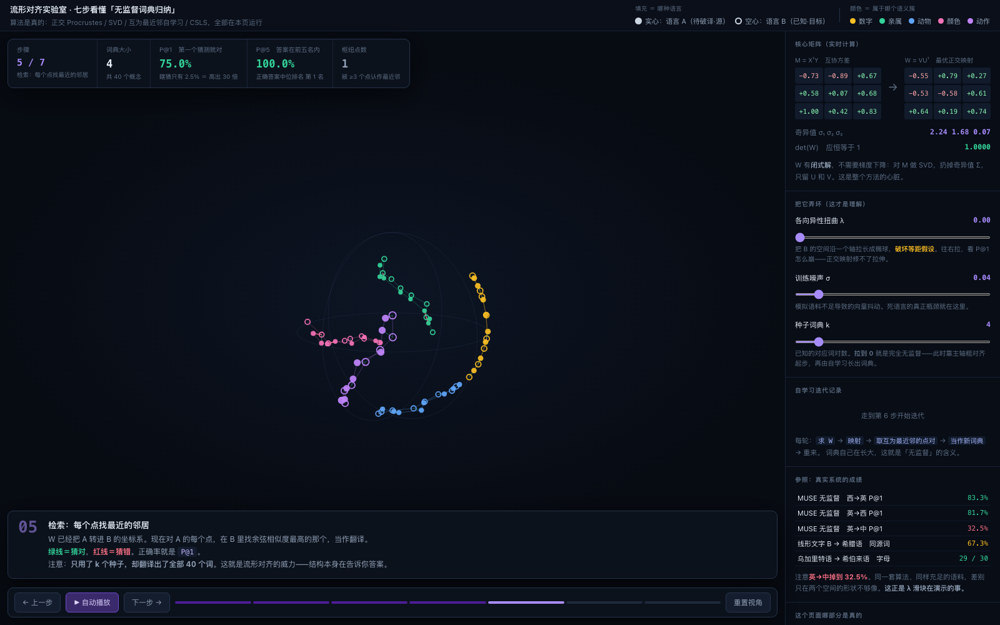

# 流形对齐实验室

**七步看懂「无监督词典归纳」——两种语言各自训出的向量空间，是怎么在没有任何平行语料的情况下对上的。**

> An interactive, dependency-free visualization of unsupervised bilingual lexicon induction:
> orthogonal Procrustes, SVD, self-learning, and CSLS — all computed live in the browser.

**▶ [在线体验](https://gao-cai-sheng.github.io/manifold-alignment-lab/)**

单文件、零依赖、断网可用。双击 `index.html` 也能跑。



---

## 这是什么

Mikolov 在 2013 年发现了一件反直觉的事：**两种语言各自独立训练出来的词向量空间，形状是近似相同的。**

因为世界是同一个。「三」和「四」的距离、「狗」和「狼」的距离，在任何语言里都差不多。两个空间之间只差一个**旋转**——而旋转是可以求解的。

这个页面把这件事拆成七步，每步都在浏览器里真算一遍。

## 七个步骤

| 步 | 在做什么 | 关键点 |
|---|---|---|
| 1 | 两个互不相识的空间 | 形状相同，朝向任意。你不知道哪个点对应哪个点 |
| 2 | 中心化 + 归一化 | 扔掉平移和缩放，只剩旋转这一个未知量 |
| 3 | 种子词典 | 给 k 对已知对应（k 可以为 0） |
| 4 | **SVD 求最优旋转** ★ | `M = XᵀY` → `M = UΣVᵀ` → `W = VUᵀ`。闭式解，不迭代 |
| 5 | 最近邻检索 | 绿线猜对、红线猜错，得到 P@1 |
| 6 | 自学习 | 把互为最近邻的点对当新词典，重跑，词典自己长大 |
| 7 | CSLS | 一个只在特定条件下才有用的补丁 |

第 4 步是心脏：**丢掉 Σ 只留 U 和 V**，等于强制这个映射是纯旋转、不许拉伸。因为拉伸会破坏原空间里的距离关系，而距离关系正是全部信息所在。

## 实测结果

40 个概念，随机基线 2.5%。以下数字全部由页面运行时计算：

| 设定 | P@1 | P@5 | 正确答案中位排名 |
|---|---|---|---|
| 4 对种子，SVD 一步 | 75.0% | 100% | 第 1 名 |
| 自学习 6 轮（词典 4 → 23 对） | **82.5%** | 100% | 第 1 名 |
| **零种子，完全无监督** | **82.5%** | 100% | 第 1 名 |
| 零噪声（理论上界） | 100% | 100% | 第 1 名 |

作为参照，MUSE 在真实 fastText 向量上的无监督 P@1：西→英 83.3%，英→西 81.7%。



### 把它弄坏

三个滑块，用来找出这套方法什么时候会失效。

**各向异性扭曲 λ**（破坏等距假设）：

| λ | 0 | 0.36 | 0.72 | 1.2 |
|---|---|---|---|---|
| P@1 | 82.5% | 40% | 27.5% | 12.5% |

这解释了一个真实现象：同一套算法、同样充足的语料，MUSE 在英↔西上有 81.7%，在**英↔中上只有 32.5%**。差别不在数据量，在两个空间的形状不够像。



**训练噪声 σ**（模拟语料不足）：

| σ | 0 | 0.04 | 0.10 | 0.20 |
|---|---|---|---|---|
| P@1 | 100% | 82.5% | 57.5% | 27.5% |

这是死语言的真正瓶颈。吐火罗语现存约 7,600 件残卷，词次量级 10⁴–10⁵；训词向量通常需要 10⁸ 以上，**差三到四个数量级**。

**CSLS 的净增益**——它的效果完全取决于你的数据有没有 hubness 这个病：

| 条件 | σ=0.04 干净 | σ=0.08 | σ=0.12 | σ=0.20 | λ=0.5 |
|---|---|---|---|---|---|
| 净增益 | **−20** | ±0 | +2.5 | +5 | **+10** |

数据干净时它是负担，数据一乱它才回本。**照搬论文里的技巧之前，先量一下自己的数据到底有没有那个病。**

## 哪部分是真的

**算法 100% 真实。** 正交 Procrustes 闭式解、3×3 SVD（用 Jacobi 特征分解实现）、互为最近邻筛选、CSLS 邻域校正、P@1 / P@5 评测——全是页面里现算的，动滑块就重跑。

打开控制台有自检：零噪声时 Procrustes 必须完美复原原始旋转。

```
最大逐点复原误差 = 2.99e-16  ✓
P@1 = 100.0%                 ✓
det(W) = 1.000000            ✓ 是纯旋转
```

**数据是受控生成的。** 40 个概念先在球面上构造出一个语义流形（5 个语义簇，簇内带真实序结构），再生成两份带独立噪声、独立随机旋转的副本，当作两种语言。

这是故意的。真实词向量是 300 维，你看不见；而学算法必须亲眼看到旋转。受控数据还有个好处——**有标准答案**，每个点该配哪个点是已知的，所以 P@1 是真分数而不是估计。

**受控数据也有它演示不了的东西。** 最典型的是 hubness：它来自真实语料的词频分布，随机撒的点造不出来。所以第 7 步里 CSLS 在默认设定下是负增益——这个负数是实测的，没有为了好看去调参把它抹平。

## 视觉编码

画面上有两套编码，别搞混：

- **填充 = 哪种语言**　实心 = 语言 A（待破译·源），空心 = 语言 B（已知·目标）
- **颜色 = 属于哪个语义簇**　数字 / 亲属 / 动物 / 颜色 / 动作

对齐成功的样子，就是同色的实心点和空心圈重合。



## URL 参数

可以用 URL 片段直接定位到某个状态，便于分享：

```
index.html#step=4                 跳到第 4 步（SVD）
index.html#step=6&k=0             第 6 步，零种子（完全无监督）
index.html#step=7&csls=1          第 7 步，开启 CSLS
index.html#step=5&lam=0.9         第 5 步，等距假设已被破坏
```

支持的键：`step`(1–7) `k` `noise` `lam` `csls` `yaw` `pitch`

## 运行

```bash
open index.html
```

没有构建步骤，没有 npm，没有 CDN。整个项目就是一个 42 KB 的 HTML 文件。

## 这不是什么

这**不是**「机器破译了某种失传语言」的演示。

真实的机器破译成果长这样：

- **乌加里特语 → 希伯来语**（Snyder, Barzilay & Knight, ACL 2010）：30 个字母对了 29 个，有希伯来同源词的乌加里特词 60% 找对。
- **线形文字 B → 古希腊语**（Luo, Cao & Barzilay, ACL 2019）：同源词 67.3% 翻译正确。人类对照组是 Ventris 1952 年的手工破译。
- **线形文字 A**：至今没破。同一批人用同样方法去试，结论是跟所有已知候选语言都对不上。

本页演示的是这些工作背后的**几何机制**，不是成果本身。

## 参考

- Mikolov et al. 2013 — 发现跨语言词向量空间之间存在近似线性映射
- Xing et al. 2015 — 把映射约束成正交矩阵，效果反而更好
- Artetxe et al. 2018 — 自学习：小种子词典可以自举成大词典
- [Conneau & Lample et al. 2018 (MUSE)](https://arxiv.org/abs/1710.04087) — 对抗初始化 + CSLS，做到零种子
- Søgaard et al. 2018 — 等距假设在语系差距大时会失效
- [Snyder, Barzilay & Knight 2010](https://aclanthology.org/P10-1107/) — 乌加里特语的统计破译
- [Luo, Cao & Barzilay 2019](https://aclanthology.org/P19-1303/) — 从乌加里特语到线形文字 B

## 许可

MIT
